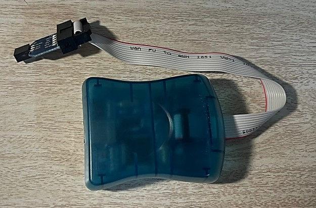

# Instructions to Build, Download and Test Robhan Robotics' Force Foot PCB

The purpose of this file is to deeply explain how to buils, download and test the Force Foot PCB from [Rhoban Robotics](https://github.com/Rhoban/ForceFoot/tree/master) using the ATMEGA 328P microcontroller and a TTL communication.

---
## PCB and Electronics

### Gerber Files

The Gerber Files necessary to manufacture the Force Foot can be accessed [here](https://github.com/Rhoban/ForceFoot/tree/master/electronics/gerber).

<p align="center">

</p>

It is recomended to manufature the board with a company that can solder the components, since the vast mayority of them are SMD and requiere superficial soldering.

### Electronic Components

The list of electronic components for the PCB is [this one](https://github.com/Rhoban/ForceFoot/blob/master/electronics/BOM_3p.xlsx). 

Note that there are 4 resistors missing in this list, and that in Mexico it is difficult to find certain components for the PCB. The following image contains the solution for this.

<p align="center">

</p>

### Final product

Everything manufactured and soldered for TTL (3-pin) comunication should look like this.

<p align="center">

</p>

## Fimware Installation

### Requiered Hardware

For the fimware install on the board's ATMEGA328P it is necessary to have an AVR ISP MkII programmer,this component can be bought in Amazon.

<p align="center">

</p>

### Software Prereqisites and Programs

For the fimware install you should have an Ubuntu or Linux OS.

#### Requiered Packages

Install AVRDUDE to program AVR microcontrollers from Ubuntu/Linux.

```nano 
sudo apt-get -y install avrdude
```

Install the Atmel AVR microcontrollers header files and the GNU Compiler Collection for AVR microcontrollers.

```nano 
sudo apt-get install avr-libc gcc-avr
```

#### Fimware files

Clone the entire [fimware directory](https://github.com/Rhoban/ForceFoot/tree/master/firmware) from Rhoban Robotics Force Foot Sensor.

Open the `Makefile.config` and set `MCU_TARGET` to `atmega328p`.

### Installation Process

#### Connections

Connect the AVR ISP MkII programmer to the computer using the blue cable. If everything works properly, you should see a red LED turn on next to the blue cable.

<p align="center">

</p>

Conect the programmer to the Force Foot and be **very careful** with the orientation of the pins, the connection must be **exactly** as the image. ***CHECK PIN NAMES***

<p align="center">

</p>

To do a fimware install the ATMEGA328P must have power, so it is necesary to provide aexternal power supply. This can be done with an Arduino, a Raspberry Pi or any microcontroller with a 5V and a GND pin.

Connect the power supply to the board as shown in the follwoing picture.

<p align="center">

</p>

If the powew supply is connected correclty, an orange LED will blink on the programmer, meanning that the programmer is detecting the microcontrller and it is ready for fimware install. 

The next figure shows the full conection of the Force Foot ready for fimware install.

<p align="center">

</p>

#### Fimware Install

To install the fimware open a terminal and go to the *fimware* directory.

Configure the fuses to use the external 16Mhz quartz.

```nano 
./fuse-m328p.sh
```
If everything went well you should see the following output on the terminal and the orange LED will turn green.

<p align="center">

</p>

Make sure that in the `Makefile.config` varaible `MCU_TARGET` is set to `atmega328p` and install the fimware.

```nano 
make
```

If everything went well you should see the following output on the terminal.

<p align="center">

</p>

If something went wrong or if you want to reinstall the fimware run `make clear` and then run `make`.

## Funcionality Tests

IN PROGRESS
