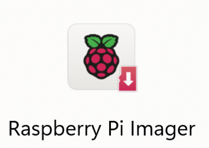
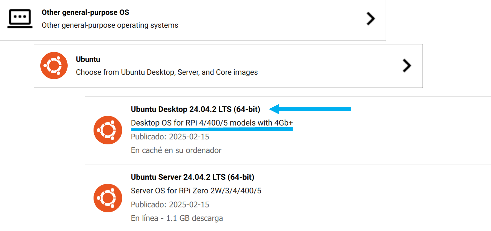

# Instructions to Configure Bogo's Raspberry Pi 4 or 5

Mmmmmmm

---
## Ubuntu 24.04.02 LTS Instalation

### Requiered Hardware

1. Personal Computer
2. Kingston or SanDisk Ultra MicroSD Card 64 GB minimum (do not use ADATA since the data transfer speed is tow low snd the RPi can no work properly).
3. Adapter to connect the MicroSD to the computer (if needed).

### Raspberry Pi Imager Install

1. Install the Rasberry Pi Imager needed for your OS from this link: 
2. Excecute the installation file and acept terms and conditions.
3. Open the Raspberry Pi Imager program.
4. If the installation is succesfull you will see the following app in ypour computer.

<p align="center">

</p>

### Ubuntu 24.04.02 LTS with Raspberry Pi Imager

1. Open Raspberry Pi Imager and click on choose device and select Raspberry Pi 4 or Raspberry Pi 5 according to the RPi specificatcions.
2. Click on choose OS, scroll down and click in Other General Purpose OS -> Ubuntu -> Ubuntu Desktop 24.04.02 LTS (64-bit). Make sure you click on the RPi 4/400/5 Model.

<p align="center">

</p>

3. Select the target MircoSD and click on start.

4. Once the OS is installed, insert the MicroSD in the Raspberry Pi and conect it to the power source.

### Ubuntu 24.04.02 LTS Setup

1. Timezone
2. Keyboard
3. Desktop
4. sudo apt 

---
## ROS2 Jazzy Jalisco Installation

This section contains the ROS2 Jazzy Jalisco Installation steps for Ubuntu. You can also find them in the [ROS2 Jazzy Jalisco Documentation](hhttps://docs.ros.org/en/jazzy/Installation/Ubuntu-Install-Debs.html#next-steps).

### System Setup

Setup requiered for install

```nano 
locale  # check for UTF-8

sudo apt update && sudo apt install locales
sudo locale-gen en_US en_US.UTF-8
sudo update-locale LC_ALL=en_US.UTF-8 LANG=en_US.UTF-8
export LANG=en_US.UTF-8

locale  # verify settings 
```

Enable Ubuntu Universe Repositories
```nano 
sudo apt install software-properties-common
sudo add-apt-repository universe
```

Add the ROS 2 GPG Key
```nano 
sudo apt update && sudo apt install curl -y
sudo curl -sSL https://raw.githubusercontent.com/ros/rosdistro/master/ros.key -o /usr/share/keyrings/ros-archive-keyring.gpg
```
Add the repository to your sources list
```nano 
echo "deb [arch=$(dpkg --print-architecture) signed-by=/usr/share/keyrings/ros-archive-keyring.gpg] http://packages.ros.org/ros2/ubuntu $(. /etc/os-release && echo $UBUNTU_CODENAME) main" | sudo tee /etc/apt/sources.list.d/ros2.list > /dev/null
```

Install development tools
```nano 
sudo apt update && sudo apt install ros-dev-tools
```

### Install ROS2 Jazzy

Update apt repository
```nano 
sudo apt update
```

Upgarde apt repository
```nano 
sudo apt upgrade
```

ROS2 Desktop Install
```nano 
sudo apt install ros-jazzy-desktop
```

### ROS2 Jazzy Test Install

Open a new terminal and excecute the follwong commands
```nano 
source /opt/ros/jazzy/setup.bash
ros2 topic list
```

If the installation is successfull you should be able to see  `\event_parameter` and  `\rosout` in your terminal.

Change to the root directoy and create the ROS2 Workspace.

```nano 
cd 
mkdir  ros2_ws/src
```

Change to your ROS2 Workspace and compile it to set it up.

```nano 
cd ros2_ws
colcon build
```

If everything worked properly you should recive a message saying `0 packages compiled` and when you run `ls` you should have the `build`, `install`, `log` and `src` directories.

### Configure `.bashrc` file

Change to the root directoy and open the `.bashrc` file using nano.

```nano 
cd 
nano .bashrc
```

Paste the following lines at the end of the `.bashrc` file to configure ROS2 enviorment in the terminal

```nano

source /opt/ros/humble/setup.bash
source /usr/share/colcon_argcomplete/hook/colcon-argcomplete.bash
source /usr/share/colcon_cd/function/colcon_cd.sh
export _colcon_cd_root_=/opt/ros/humble
source ~/ros2_ws/install/setup.bash
```

Paste the following lines at the end of the `.bashrc` file to create an alias for easy ROS2 compilation and easy enviorment update.

```nano
alias cb="cd ~/ros2_ws; colcon build && source install/setup.bash" 
alias so="cd ~/ros2_ws; source install/setup.bash"
```

Save the `.bashrc` file, close the terminal and open a new one to apply changes.

---
## Dynamixel SDK Installation and Setup

---
## MPU6050 Installation and Setup

---
## HX711 Installation and Setup

---
## Remote Conection

Ethernet 
Hotspot
SSH
